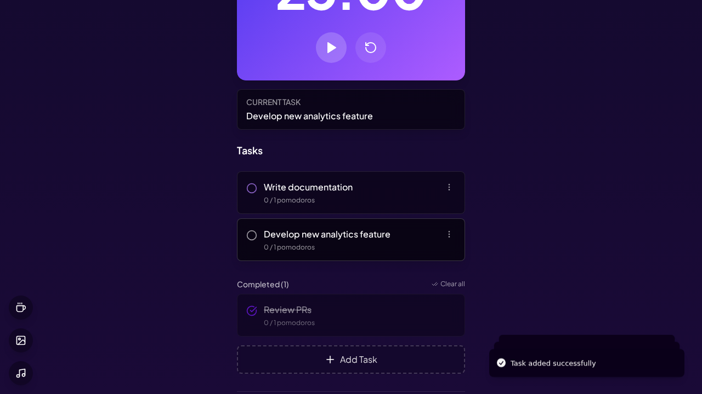

# Dorofy - A Minimalist Pomodoro Timer & Task Manager

Dorofy is a clean, modern, and feature-rich productivity application designed to help you stay focused and manage your tasks effectively using the Pomodoro Technique.



## ✨ Features

- **Pomodoro Timer**: A flexible timer with standard (25 min) and long (50 min) focus sessions, as well as short and long breaks.
- **Task Management**: A simple yet powerful task list where you can add, complete, and track your tasks.
- **Pomodoro Integration**: Automatically track the number of Pomodoro sessions completed for each task.
- **Productivity Analytics**: A dedicated analytics page to visualize your focus sessions and review your completed task history, helping you understand your work patterns.
- **Customizable Experience**:
    - **Themes**: Switch between light and dark modes.
    - **Backgrounds**: Personalize your workspace with different animated backgrounds.
- **Music Player**: An integrated music player with lo-fi beats to help you concentrate.
- **Fullscreen Mode**: Immerse yourself in your focus session with a minimalist fullscreen timer view.
- **Desktop Notifications**: Get notified when a session or break is over.

## 🚀 Tech Stack

- **Framework**: [React](https://react.dev/)
- **Build Tool**: [Vite](https://vitejs.dev/)
- **Language**: [TypeScript](https://www.typescriptlang.org/)
- **Styling**: [Tailwind CSS](https://tailwindcss.com/)
- **UI Components**: [shadcn-ui](https://ui.shadcn.com/)
- **Animations**: [Framer Motion](https://www.framer.com/motion/)

## 📦 Getting Started

To get a local copy up and running, follow these simple steps.

### Prerequisites

You need to have [Node.js](https://nodejs.org/) and [npm](https://www.npmjs.com/) installed on your machine. We recommend using [nvm](https://github.com/nvm-sh/nvm) to manage Node.js versions.

### Installation

1.  **Clone the repository:**
    ```sh
    git clone <YOUR_GIT_URL>
    ```
2.  **Navigate to the project directory:**
    ```sh
    cd dorofy-app # Or your project name
    ```
3.  **Install dependencies:**
    ```sh
    npm install
    ```
4.  **Start the development server:**
    ```sh
    npm run dev
    ```
    The application should now be running on `http://localhost:8080`.

## 🙏 Acknowledgments

- This project was originally created by **Faiz Intifada**.
- The initial project scaffolding was provided by [Lovable](https://lovable.dev/).

---

*This README was generated by Jules, your AI Software Engineer.*
